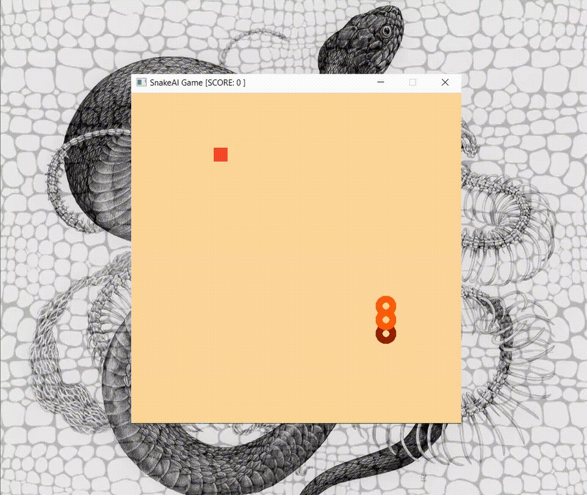

#  🎮 Duo

Duo is a collection of games in Rust. An attempt to learning the Rust language, and was used to practice some concepts in Data Parallelism and Game Design. 

# 🛸 alienscape 🛸
Alienscape was built using the GGEZ game framework in Rust. As the alien, your goal is to board the ship without letting the clowns catch you.


## Key Controls:
- Up/Down/Left/Right: to change directions.
- Space (game: on): to boost speed 
- Space (game: off): to play again.
  

# 🐍 centisnake 🐍
A snake game implementation using the Piston game engine wrapper.



Done some reading on reinforcement learning (Q-Learning) and genetic algorithm for the purpose of training the snake to find the fruit. Mission aborted (for now).
## Key Controls:

- W/A/S/D OR Up/Down/Left/Right: to change directions.

- Space: to play again.

#

## Play Locally
```
git clone https://github.com/yaqoah/duo.git
cd duo
cd alienscape (OR) cd centisnake
cargo run
```
